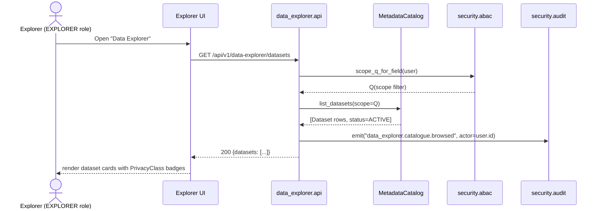
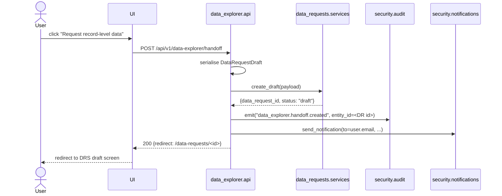

# ADR-0023: Data Explorer module (apps/data_explorer / DATA-EXP)

- **Status**: Proposed
- **Date**: 27 May 2026
- **Owner**: NSR MIS Architecture Team
- **Decision-makers**: NSR Unit Coordinator, Data Protection Officer, Engineering Lead, M&E Lead
- **References**: SAD §4.5 (API-DRS), §8 (Security), §9 (NFR responses), §12.1 (DRS-O-01..O-06); ADR-0001 (architecture style); ADR-0005 (sub-region partitioning); ADR-0008 (pagination & throttling); ADR-0010 (ChoiceList); ADR-0013 (canonical Partner + DSA); ADR-0019 (sensitive-health encryption); /docs/04_ui_design_brief.md §5.10 + §8 (sensitivity vocabulary); US-DATA-EXP-001.

---

## Context

API-DRS (SAD §4.5) is a heavy-weight gate: every record-level extract requires a DSA, a DPO review path, a watermarked encrypted bundle, and a 14-day pre-signed delivery URL. That workflow is right for **record-level** sharing but is wrong for **discovery**. Today an M&E analyst, an NSR Unit officer, or a partner-side researcher has no way to answer "what data does the registry actually hold for elderly-headed households in Karamoja?" without filing a DRS request and waiting for DPO approval — even if all they want is a row count.

The cost of conflation is felt in three places:

1. **Friction tax on legitimate analytics.** Operational dashboards in RPT serve fixed KPIs. Anything ad-hoc has to go through DRS as a record-level request. Partners are bypassing the registry and importing stale CSVs into their own MIS instead.
2. **DPO queue inflation.** DRS-O-01 (row-count budgets) is unresolved partly because we cannot tell whether a request is a 50,000-row discovery probe or a 50,000-row record-level delivery. Counting both as "rows shipped" against the same budget is the wrong signal.
3. **Cross-DSA-boundary discovery is impossible.** A researcher with no DSA today cannot even establish that the data they need exists. They request blind, the DPO rejects, the loop restarts.

The user-research finding (US-DATA-EXP-001 background): **most "data requests" filed against the registry today are answerable by an aggregate**. The record-level handoff is the exception, not the default.

DATA-EXP separates the two surfaces. It is the discovery + aggregate-preview surface; API-DRS remains the record-level delivery surface; RPT remains the operational-dashboard surface. The three are read-only consumers of the registry; only DATA-EXP and RPT are new surfaces. API-DRS already exists.

This ADR locks the module boundary, the read path, the k-anonymity enforcement layer, the metadata-driven catalogue, the NFR targets, and the surface-area additions to the design-brief vocabulary. Decisions 1–4 below were locked by the user before this ADR was drafted; this document records the rationale and the consequences. Open items the user must decide before the four parallel build agents start are in §"Open items".

## Decision

### D1. Module boundary: data_explorer owns discovery + aggregate; api_drs owns record-level; reporting owns operational dashboards.

`apps/data_explorer/` is a new Django app. Its surface is exhaustively defined by **what it must own**, **what it must consume**, **what it must hand off**, and **what it must refuse**.

| Concern | DATA-EXP | API-DRS (`apps/data_requests/`) | RPT (`apps/reporting/`) |
|---|---|---|---|
| Dataset / variable catalogue | OWNS (`Dataset`, `Variable`, `PrivacyClass`, `VariableApproval`) | consumes for Field Selector | does not consume |
| Aggregate counts / cell suppression | OWNS (single `Suppressor` service) | does not run | aggregates only via fixed dashboard tiles, not user-driven |
| Record-level extract (Excel/CSV/API) | **FORBIDDEN** | OWNS (`DataRequest`, `Approval`, `Delivery`, `PasswordToken`, `DownloadEvent`) | does not run |
| DSA / DPA enforcement | does not enforce DSAs (catalogue is metadata, not data) | OWNS DSA validation, budget, scope | does not enforce |
| Operational dashboards | **FORBIDDEN** | does not own | OWNS |
| Geographic minimum aggregation | sub-county (refuses below) | record-level (DSA-scoped) | per-tile design |
| Handoff to next stage | emits a draft DataRequest seed into API-DRS | consumes seed; runs full DRS workflow | n/a |

**Forbidden directions, stated explicitly so the four parallel build agents have unambiguous lanes:**

- **data_explorer must not** write to DAT, run record-level extracts, deliver password-protected files, generate pre-signed URLs, or expose a row whose entity-level identifier (Registry ID, Person ID, NIN hash, GPS point) appears in the response body.
- **api_drs must not** expose the dataset/variable catalogue, run cell-suppression, or accept queries below the sub-county geographic floor on a discovery path. It accepts the DATA-EXP handoff payload as a draft `DataRequest` and runs its own validation from there.
- **reporting must not** accept user-driven filter expressions against personal data; dashboards are pre-defined tiles refreshed on a schedule.

**Handoff payload shape (DATA-EXP → API-DRS):** when the user clicks "Request record-level data" on an aggregate view, DATA-EXP serialises a `DataRequestDraft` object and POSTs it to `apps.data_requests.services.create_draft(...)`. Shape:

```
{
  "source_module": "data_explorer",
  "source_query_hash": "<sha256 of canonical query JSON>",
  "purpose_of_use": "<free text>",
  "requested_entity": "Household" | "Member" | ...,
  "requested_fields": ["<variable.code>", ...],
  "geographic_scope": {"level": "sub_region|district|sub_county", "codes": [...]},
  "filter_expression": { /* same Query JSON shape API-DRS already accepts */ },
  "estimated_row_count": <int from the suppressed aggregate>,
  "explorer_session_id": "<ULID>"
}
```

### D2. Read path: PostgreSQL read replica + materialised views. No OpenSearch in this slice.

Locked by the user; aligned with SAD §9 ("read replicas for analytics queries").

**Replica routing.** A new Django database alias `analytics_replica` is added under `nsr_mis/settings.py` `DATABASES`. A custom router `apps.data_explorer.db_router.AnalyticsReplicaRouter` directs every read from `apps.data_explorer.*` to `analytics_replica`; writes forbidden (router returns `False` for `db_for_write` on this app's models). Tests + dev may alias `default` to `analytics_replica` for convenience; staging + prod must not.

**Proposed matviews (initial set):**

| Matview | Source | Refresh cadence | PrivacyClass |
|---|---|---|---|
| `mv_explorer_household_by_subcounty_demographics` | Household + Member aggregates | daily 02:00 EAT | Internal |
| `mv_explorer_household_by_subcounty_pmt` | Household × PMTResult | daily 02:30 EAT | Internal |
| `mv_explorer_member_by_subcounty_education` | Member × Education | weekly Sun 03:00 EAT | Internal |
| `mv_explorer_member_by_subcounty_employment` | Member × Employment | weekly Sun 03:30 EAT | Internal |
| `mv_explorer_household_shocks_subregion` | Shock × Household | weekly Sun 04:00 EAT | Public |
| `mv_explorer_referrals_subcounty` | Referral × Household | daily 02:45 EAT | Internal |
| `mv_explorer_grievances_subcounty` | Grievance | daily 03:00 EAT | Internal |
| `mv_explorer_health_chronic_subregion` | Health × Member | weekly Sun 04:30 EAT | Personal |

`Personal`-class matviews aggregate **at sub-region only**, never sub-county. This bakes the geographic-minimum-aggregation rule (D4) into the matview shape itself, so the suppressor isn't the only line of defence. `Sensitive` data has no matview.

Matview rows carry a `refreshed_at` column. Every aggregate response carries `{matview, refreshed_at, staleness_seconds}` in its metadata.

**Stale-matview fallback.** If `staleness_seconds > 2 × cadence`, the aggregate endpoint returns HTTP 503 with `{error: "matview_stale"}` and emits `data_explorer.matview.stale`. We do **not** silently fall back to a live query against DAT.

**Refresh mechanism.** `REFRESH MATERIALIZED VIEW CONCURRENTLY` driven by Celery beat on the replica. Concurrent refresh requires a unique index per matview; the DBA owns those.

**No-OpenSearch note.** Catalogue free-text search uses PostgreSQL `tsvector` GIN indexes on `Dataset.description` and `Variable.label / Variable.synonyms`. OpenSearch deferred — see OPEN-2.

### D3. k-anonymity at the service layer (the `Suppressor`).

A single class `apps.data_explorer.services.Suppressor` is the only path that converts a raw aggregate into a user-visible response. **Every** aggregate response flows through it.

| Layer | Rejected because |
|---|---|
| **Database (RLS / triggers / custom k-anon views)** | (a) Cell-level suppression requires knowing query-shape; RLS cannot reason about result-set-wide grouping. (b) Custom triggers fight `REFRESH MATERIALIZED VIEW CONCURRENTLY`. (c) Per CLAUDE.md, no raw SQL outside `data_management` + `ingestion_hub`. |
| **Gateway (Kong / APISIX response rewrite)** | (a) Internal callers bypass the gateway. (b) Vocabulary drift inevitable. (c) Gateway's job is auth + rate-limit + audit + route, not domain logic. |
| **Service (`Suppressor`)** | Single funnel; testable; auditable; k_floor lives next to schema. **CHOSEN.** |

**Cell-suppression rule.** For each result row `{group_keys..., count}`:

1. Look up the `PrivacyClass` of every variable contributing to the count (projected variables **plus** filter variables — strictest class wins).
2. If strictest class is `Sensitive`, refuse the query at validation time. Catalogue surfaces the dictionary entry; count never computed.
3. If `count < k_floor`, replace `count` with `null` and add `suppressed: true`. **Do not return the original number. Do not return an upper-bound "≤ 5"** — that leaks the bound.
4. If `count ≥ k_floor`, return the count and `suppressed: false`.
5. Response carries `suppressed_cell_count` so UI can show "12 of 47 cells suppressed".

**Locked PrivacyClass catalogue (the 4 rows):**

| Class | k_floor | Daily query cap (proposed; see OPEN-3) | Refresh cadence default |
|---|---|---|---|
| `Public` | 0 | unlimited | weekly |
| `Internal` | 5 | 100 queries / user / day | daily |
| `Personal` | 10 | 25 queries / user / day | weekly |
| `Sensitive` | — (blocked) | 0 | n/a |

**Reconstruction-attack defence.** Every aggregate query writes a row to `AggregateQueryLog` (separate table from `AuditEvent`, because cardinality is per-cell-suppression-event scale). Shape: `{id (ULID), actor, executed_at, dataset, projection_variables, filter_variables, filter_hash, geographic_scope, result_row_count, suppressed_cell_count, query_hash}`. A nightly Celery task `data_explorer.tasks.detect_overlap_burst` scans the last 24h and flags `(actor, dataset)` pairs with > 50 queries whose `filter_hash` overlaps by ≥ 3 dimensions. Flagged actors trigger `data_explorer.reidentification.suspected` audit + DPO email via `apps.security.notifications.send_notification`. Risk probe (Appendix A / file `0023-data-explorer-risk-probe.md`) is the test that this defence holds.

### D4. Geographic minimum aggregation: sub-county. Below that, refuse and hand off.

- Query builder's geographic-tree-picker disables parish + village rows for the discovery path. Tooltip: "Aggregate not available below sub-county. Use 'Request record-level data' for parish or village data."
- Aggregate endpoint rejects `geographic_scope.level in {parish, village}` with HTTP 422 `{error: "geographic_floor_violation", floor: "sub_county", handoff: "/api/v1/data-requests/draft"}` and emits `data_explorer.aggregate.refused_below_floor`.
- `Personal`-class matviews aggregate at sub-region (one level coarser than the floor).
- Handoff to API-DRS carries the parish/village scope the user actually wanted; DPO sees the original intent.

### D5. Metadata-driven catalogue, seeded INACTIVE, dual-approval activation.

DATA-EXP does not hand-curate its catalogue. Three sources feed the metadata loader at startup and on schema-change signal:

1. **DAT models** (`apps.data_management.models`) — every concrete field on Household, Member, Health, Disability, Education, Employment, Dwelling, Utilities, Livelihood, FoodConsumption, FoodSecurity, Shock, CopingStrategy.
2. **REF-DATA ChoiceLists** (`apps.reference_data` + `apps.data_management.choice_field_map`) — for coded fields, attach active ChoiceList code/label pairs to `Variable.value_domain`.
3. **`apps.update_workflow.field_catalog`** — already does the model-introspection work for the update-workflow wizard. **DATA-EXP reuses this**, does not duplicate. Drift between the update-workflow's editable surface and the explorer's discoverable surface is therefore impossible by construction.

**Loader lifecycle:**

- On Django startup, `apps.data_explorer.apps.DataExplorerConfig.ready()` calls `metadata_loader.refresh()` (idempotent; upsert by `(dataset_code, variable_code)`).
- On `post_migrate` signal from `data_management`, `reference_data`, `update_workflow`, loader runs again. Any `Variable` whose underlying model field has changed shape flips to **INACTIVE** automatically.
- See OPEN-4 for startup-and-signal vs signal-only.

**Activation requires dual approval.** New / modified `Variable` rows seeded `status = "inactive"`; appear with "Pending approval" badge; do not appear in the query-builder field-picker. Activation needs two distinct users — one DQA Approver and one DPO. Mirrors DAT-DQA and DAT-DDUP patterns. Approval table is `VariableApproval` (ULID, variable, approver, approved_at, approval_role, note).

**PrivacyClass assignment.** Per-model default mapping in `apps/data_explorer/seeds/privacy_class_defaults.py`. Dual-approval flow lets DPO override the default; overrides audit-logged.

### D6. NFR targets and per-class throttle.

- Catalogue browse P95 < 500 ms. Small in-memory cache populated by the metadata loader.
- Aggregate query P95 < 3 s. Single `WHERE` + `GROUP BY` on a denormalised matview row set; suppressor O(cells).
- Per-PrivacyClass throttle (proposed; see OPEN-3): Public unlimited; Internal 100/user/day + 5,000/org/day; Personal 25/user/day + 500/org/day; Sensitive 0. Counters in Redis keyed on `(actor, privacy_class, date_utc)`. Throttle decisions emit `data_explorer.throttle.exceeded`.

### D7. ULID IDs; ORM-only access; trunk-based branch.

- All externally-visible IDs are ULIDs.
- **No raw SQL inside `apps/data_explorer/`.** Query builder composes Django ORM `QuerySet` ops against matview-backed unmanaged Django models (`Meta.managed = False`). Matview DDL itself lives in `apps/data_management/` migrations (CLAUDE.md "No raw SQL outside `data_management` + `ingestion_hub`").
- Branch: `us-data-exp-001-data-explorer`. Commit prefix: `[US-DATA-EXP-001]`.

### D8. Status vocabulary additions for the design-brief amendment.

| New badge | When it appears | Proposed token | Rationale |
|---|---|---|---|
| `Suppressed` | On a cell whose count < k_floor | `--neutral-700` on `--neutral-100` | Neutral grey: not an error, the system working correctly. Mirrors "Voided" treatment in §8 of brief. |
| `Aggregated-only` | On a Variable / Dataset card whose PrivacyClass disallows record-level discovery from the Explorer | `--accent-system` on `--accent-system-bg` | The system accent already means "internal infrastructure constraint". |

Both go through the design-brief amendment process (§8 of brief). Final visual treatment is the design team's call.

### D9. Feature flag and role gating.

- **Django settings flag** `DATA_EXPLORER_ENABLED` (boolean). Default `False`. Set `True` in dev / staging; `False` in prod for MVP-1. When off, every endpoint returns 503; sidebar link hidden.
- **Keycloak realm role `EXPLORER`** — new role per ADR-0006. Read-only.
- **Sidebar link** gated on `DATA_EXPLORER_ENABLED == True AND user has EXPLORER realm role`. Hidden (not greyed) when either fails (design brief §6: "Showing forbidden items in grey is a security smell").

## Sequence diagrams

### (a) Browse catalogue



### (b) Run aggregate query with suppression

```mermaid
sequenceDiagram
    actor User
    participant UI
    participant API as data_explorer.api
    participant Val as QueryValidator
    participant Throttle as PrivacyClassThrottle
    participant Qry as AggregateQueryService
    participant MV as analytics_replica (matview)
    participant Sup as Suppressor
    participant Log as AggregateQueryLog
    participant Audit as security.audit

    User->>UI: build query
    UI->>API: POST /api/v1/data-explorer/aggregate
    API->>Val: validate(query)
    Val-->>API: ok (geo >= sub_county; no Sensitive var)
    API->>Throttle: check(user, strictest_class)
    Throttle-->>API: allowed
    API->>Qry: execute(query)
    Qry->>MV: SELECT FROM mv_explorer_... WHERE ... GROUP BY ...
    MV-->>Qry: raw rows
    Qry->>Sup: apply(rows, strictest_class, k_floor)
    Sup-->>Qry: rows with suppressed:true where count<k
    Qry->>Log: write AggregateQueryLog
    Qry->>Audit: emit("data_explorer.aggregate.executed", ...)
    Qry-->>API: {rows, metadata:{matview, refreshed_at, suppressed_cell_count}}
    API-->>UI: 200
    UI-->>User: render table with "N of M cells suppressed"
```

### (c) Handoff to API-DRS



## NFR targets

| Concern | Target |
|---|---|
| Catalogue browse P95 | < 500 ms |
| Aggregate query P95 | < 3 s |
| Throttle (Public) | unlimited |
| Throttle (Internal) | 100/user/day, 5,000/org/day (proposed; OPEN-3) |
| Throttle (Personal) | 25/user/day, 500/org/day (proposed; OPEN-3) |
| Sensitive aggregate | always 422 |
| Matview staleness fallback | 503 when `staleness > 2 × cadence` |
| Audit emission | every endpoint, every response code (including 422/503) |

## Risk register

| # | Risk | Likelihood | Impact | Mitigation |
|---|---|---|---|---|
| R1 | Re-identification via repeated overlapping queries ("small-multiples reconstruction" attack) | Medium | High | (a) `AggregateQueryLog`. (b) `detect_overlap_burst` Celery task flags actors with > 50 queries × ≥ 3 overlapping dimensions in 24h. (c) DPO email on flag. (d) Risk probe (Appendix A) asserts no household reconstructible from 100 sequential queries with 3 overlapping filters. |
| R2 | Differential / multi-query reconstruction (compute `count(A AND B) - count(A AND NOT B)` to leak a small cell) | Medium | High | Same query-log infra. Suppressor returns `null + suppressed:true`, never the original count and never an upper bound, so differencing on a suppressed cell yields `null - null = no information`. |
| R3 | Schema drift between Explorer catalogue and DAT models | Medium | Medium | (a) Metadata loader runs on `post_migrate` signal. (b) Variables with changed-shape fields flip to INACTIVE automatically. (c) Dual-approval reactivation forces human review. (d) Loader reuses `apps.update_workflow.field_catalog` rather than duplicating. |

## Implementation notes (for build agents)

- Branch: `us-data-exp-001-data-explorer`. Trunk-based; short-lived; mandatory code review.
- Commit prefix: `[US-DATA-EXP-001]`.
- All externally-visible IDs are ULIDs.
- **No raw SQL** inside `apps/data_explorer/`. Matview DDL lives in `apps/data_management/` migrations.
- Every endpoint emits `apps.security.audit.emit(...)` including 422 / 503 paths.
- DPO notifications use `apps.security.notifications.send_notification(...)`.
- Risk probe (Appendix A → `0023-data-explorer-risk-probe.md`) is a hard CI gate.

### Critical files for build agents to read first

- `apps/security/audit.py` — every endpoint calls `emit(...)`; signature fixed.
- `apps/security/abac.py` — `scope_q_for_field` for catalogue scoping.
- `apps/update_workflow/field_catalog.py` — catalogue loader **extends this**, does not duplicate.
- `apps/data_requests/models.py` + `apps/data_requests/services.py` — handoff `DataRequestDraft` shape must be acceptable to `services.create_draft(...)` (or equivalent).
- `nsr_mis/settings.py` — `DATA_EXPLORER_ENABLED` flag + `analytics_replica` alias + router.

## Open items (need user decision before code starts)

- **OPEN-1.** Matview refresh cadence per-PrivacyClass vs per-Dataset — proposed default: **per-PrivacyClass** with per-Dataset override.
- **OPEN-2.** OpenSearch in MVP-1 vs Phase 2 — proposed default: **Phase 2** (PostgreSQL `tsvector` for MVP).
- **OPEN-3.** Final daily-query-cap values for Internal and Personal classes — proposed defaults: Internal 100/user/day + 5,000/org/day; Personal 25/user/day + 500/org/day. **Build cannot start without this.**
- **OPEN-4.** Metadata loader on every startup *and* signal, or signal-only — proposed default: **startup + signal** (idempotent, race-free on first deploy).
- **OPEN-5.** `EXPLORER` role as Keycloak realm role only, or also Django Group — proposed default: **Keycloak realm role only**.
- **OPEN-6.** Abandoned-draft DRS handoff visibility to DPO — proposed default: **yes** (re-identification signal even without submit).
- **OPEN-7.** DPO mandatory on every PrivacyClass override, or downgrades only — proposed default: **DPO mandatory on every change**.

---

Signed off by:

- NSR Unit Coordinator: ____________________ Date: __________
- Data Protection Officer: ____________________ Date: __________
- Engineering Lead: ____________________ Date: __________
- M&E Lead: ____________________ Date: __________

End of ADR-0023.
