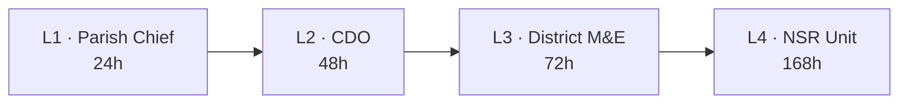
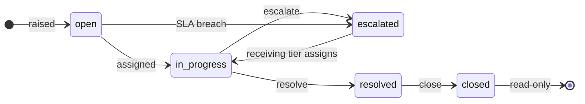

# Grievances (GRM)

!!! info "Status"
    **Built and in use** — GRM L1 intake (US-032), triage and routing (US-033), and the GRM↔UPD auto-close tween (US-034, US-094) are live.

GRM is the channel citizens use to report a problem with their record, raise a complaint, or ask for a correction. As a Parish Chief or CDO, you sit at L1 or L2 of the triage queue.

## Where to find it

| Surface | Path |
|---|---|
| Console | `/console/grm` |
| Source JSX | `/design/v0.1/screens/screens-grm.jsx → GRMScreen` |
| API | `/api/v1/grm/grievances/` |
| Audit action | `create` / `update` on `grievance`, with the reason naming what happened (`assigned`, `escalated: …`, `resolved`, `closed`) |

## Intake channels

| Channel | Status | Notes |
|---|---|---|
| Walk-in (parish office) | Built | Operator types the citizen's complaint |
| Phone (call centre) | Built | Same form, channel marked `phone` |
| SMS | Scaffolded | The inbound SMS gateway lands in S6 |
| Web | Built | Public form posts to the GRM API |
| MDA referral | Built | A partner forwards a complaint about NSR data |

## The case number

Every grievance gets a number the citizen can keep: **`GRM-2026-0001`**.
The year, then the case's number within it, restarting each January.

Give the citizen that number, not the long `01M3AT…` identifier — they
cannot write that down over a phone and neither can you.

To find a case again, type the number into the search box at the top of
the workbench. It accepts the number however it reaches you: lower
case, without the dashes, without the `GRM-`, and with a letter **O**
typed for zero or **I** for one.

## The four tiers

| Tier | Who handles it | Typical case |
|---|---|---|
| L1 | Parish Chief | Wrong household member listed, GPS misplaced |
| L2 | CDO | Disputed head of household, sub-county dispute |
| L3 | District M&E | Cases the CDO cannot settle |
| L4 | NSR Unit | Fraud, identity theft, DSA misuse |

!!! warning "This page used to describe three tiers"
    It listed L1, L2 and "L3 NSR Unit", and gave SLAs in days — "L1
    walk-in: 7 days, L3 fraud: 30 days". There are **four** tiers and
    the windows are hours. Corrected 25 September 2026.

The tier's role and its window come from the `GrmTierRule` table, which
an administrator can retune without a software release. This page used
to say the matrix lived "in REF-DATA as a ChoiceList" — it never did.

## The grievance lifecycle

| State | What it means |
|---|---|
| `open` | Raised, nobody working it |
| `in_progress` | Somebody owns it |
| `escalated` | Sent up a tier, waiting to be picked up |
| `resolved` | Settled, in the grace period before closing |
| `closed` | Final — and there is no reopen |

!!! note "There is no `triaged` state"
    This page used to list one. A case goes from `open` to
    `in_progress` when somebody is **assigned** to it; assignment is
    the triage.

## Escalation restarts the clock

When a case goes up a tier it is **unassigned** and the receiving tier
gets its **full window from that moment** — not from when the case was
first raised.

A scheduled sweep escalates breached cases on its own, one tier per
run, recorded as `system` with the reason *SLA breached*. A case
already at L4 is flagged rather than escalated.

## Linking to UPD

If the resolution needs a data change, open the grievance and click
**Open an update from this grievance** in the DATA UPDATE block. That
creates a change request in **Draft**, linked both ways, and the case
panel then shows a link straight to it.

Because it is a draft, it appears under the **Drafts** tab of the
Updates queue — not Pending. Somebody still has to fill in the change
and submit it.

When that update **commits**, the grievance closes itself. You do not
close it by hand.

Only one update per grievance: once a case has one, the button is
replaced by the link to it.

## SLA and breach

The SLA is the current **tier's** window, counted from when that tier
received the case. The **Past SLA (any tier)** quick filter on the
workbench shows everything breached and not yet resolved. Work those
first — the SLA is the promise made to the citizen and it is the one
thing that cannot be recovered once it is gone.

## What you can see

You see grievances in **your area**, plus any case assigned to you or
on which you hold an open task — wherever it is. GRM Officers and
administrators see the whole queue.

The workbench list, the dashboard tile and the sidebar badge all apply
that same rule, so they cannot disagree with one another.

!!! warning "There is no per-case confidentiality flag"
    This page used to say fraud and DPPA cases were "marked sensitive"
    and hidden from L1 and L2 operators. **No such flag exists.**
    Visibility is geographic scope plus ownership, and nothing else.

    If a case genuinely must be restricted, the only lever today is who
    it is assigned to and which area it belongs to. Raised as an open
    item rather than left implied. Corrected 25 September 2026.

## Related

- [Update requests](update-requests.md) — what happens when the resolution needs a data change
- [GRM module reference](../modules/grm.md)
- [GRM Officer — running the queue](../grm/index.md) — for the people who work what you raise
