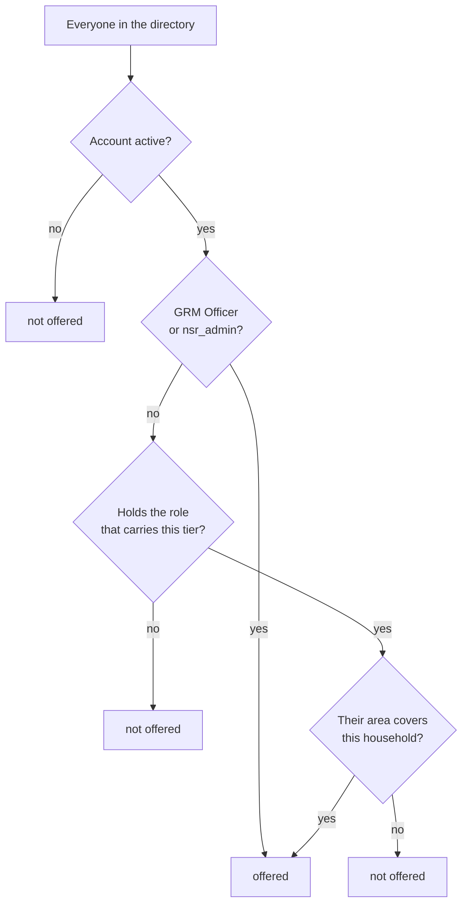

# Assigning a case

A grievance with no owner is a grievance nobody is working. Assignment
is how a case becomes somebody's job.

## Take it yourself

Open the case and click **Assign to me**. That is the whole action — it
does not open a picker, because you have already said who.

It appears on any case that will accept an assignment, including one
already assigned to somebody else, so taking a case over is one click.

## Give it to somebody else

1. Open the case.
2. Click **Assign…**.
3. Search by name or username.
4. Pick the person and confirm.

## Who the picker offers

Not everybody. Only people who could actually do the work.

The tier's role comes from the escalation ladder:

| Tier | Role that carries it |
|---|---|
| L1 | Parish Chief |
| L2 | CDO |
| L3 | District M&E |
| L4 | NSR Unit Coordinator |

GRM Officers and administrators are offered for any tier, because they
already work the whole queue.

!!! warning "An empty picker means something real"
    *"Nobody holds this tier's role with access to this household."*

    That is not a fault. Nobody in the directory can take this case.
    Your options:

    1. **Escalate it** to a tier that does have holders.
    2. **Ask your administrator** to grant somebody the role, or widen
       an existing person's area.

    It is worth checking: a district with no CDO on the system is a gap
    that will bite on every case at that tier, not just this one.

## Why assignment can be refused

Even if you type a name by hand, the server applies the same rule.

| Message | What it means | What to do |
|---|---|---|
| *is not an active MIS user* | the account does not exist or is deactivated | pick from the list |
| *does not hold `cdo`, the role that carries l2_cdo cases* | wrong role for this tier | pick someone with it, or escalate |
| *has no access to the household this case is about* | right role, wrong area | find somebody who covers that area |

!!! note "Why the rule exists"
    Without it an L3 District case could be handed to an enumerator in
    another sub-region. They would get the email, follow the link, and
    be refused their own work — and the case would sit with a named
    owner who could not open it.

## Assigning several at once

Tick the rows, click **Assign**, pick a person.

If the ticked cases are at the **same tier and about the same
household**, the picker shows the people eligible for all of them.

If they are mixed, there is no single eligible list — so the dialog says
so, offers the full directory, and each assignment is checked on submit.
Any that are refused are listed afterwards with the reason.

## What happens after

- The case moves to **In progress**.
- The assignee gets an **email**, if they have an address on file. If
  they do not, the dialog warns you — the case still appears in their
  queue.
- The assignment is written to the **audit chain** with your name
  against it.
