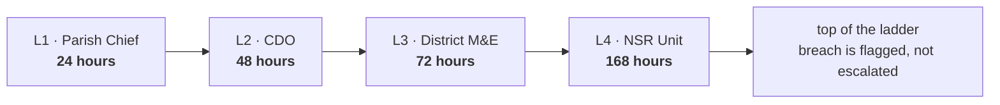
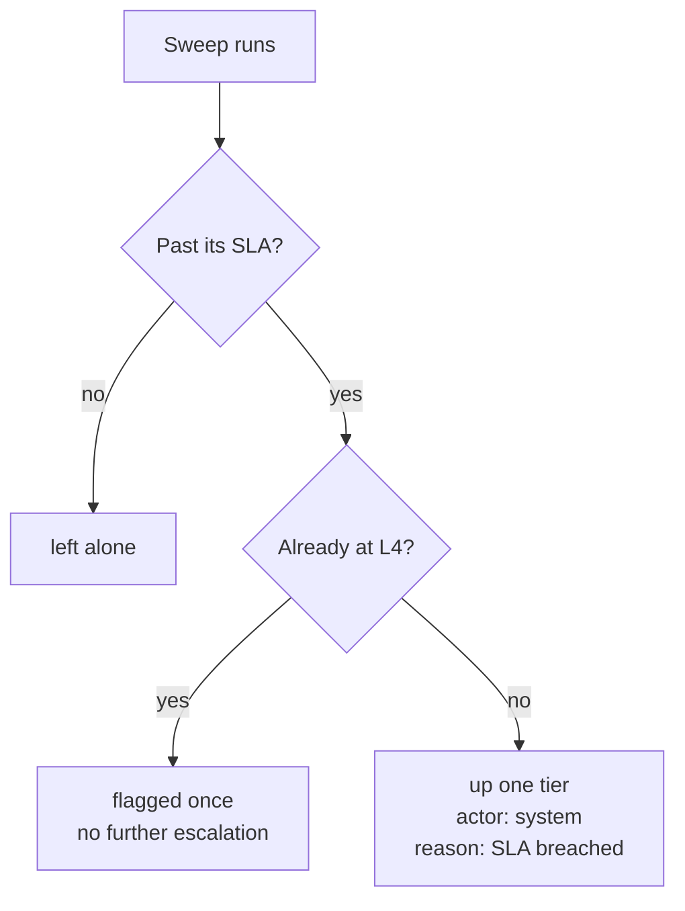

# Escalation and SLA

Every tier gets a window. When it runs out, the case goes up.

## The ladder

!!! note "These windows are configuration"
    An administrator can retune a tier's window without a software
    release. If the numbers above do not match what you see on screen,
    the screen is right — check with your administrator rather than
    this page.

## Escalating by hand

1. Open the case.
2. Click **Escalate one tier**.
3. Pick a **reason** from the list.
4. Add a **note** — at least a few words of context.
5. **Escalate**.

The reason and note go into the audit chain. The next tier reads them
first.

### What escalation does

- Moves the case **up one tier**.
- Sets the status to **Escalated**.
- **Clears the assignee** — the receiving tier decides who takes it.
- **Restarts the clock**. The new tier gets its full window from now.

!!! warning "The clock restarts — this used to be wrong"
    Until September 2026 the SLA was measured from when the case was
    first opened, at every tier. Escalating a case that had already
    blown its L1 deadline handed L2 a deadline in the past. On
    production, cases showed as 2,900 hours overdue at a tier they had
    only just reached.

**Escalate** does not appear on a case at L4, or on one that is
resolved or closed.

## Automatic escalation

A scheduled sweep escalates breached cases on its own.

One tier per run, so a badly overdue case climbs steadily rather than
jumping to L4 in a single step. An L4 case is flagged once — it does not
re-flag on every sweep.

You will see these in the timeline as **system**, with the reason *SLA
breached*.

## When a case reaches you by escalation

It arrives **unassigned**, with a fresh clock and a reason from the tier
below. Two things to do:

1. Read the escalation reason and the note. That is the previous tier
   telling you why they could not settle it.
2. **Assign it** — to yourself or to somebody at your tier. Until
   somebody owns it, nobody is working it.

Use the **Escalated** quick filter to see everything waiting in this
state.
