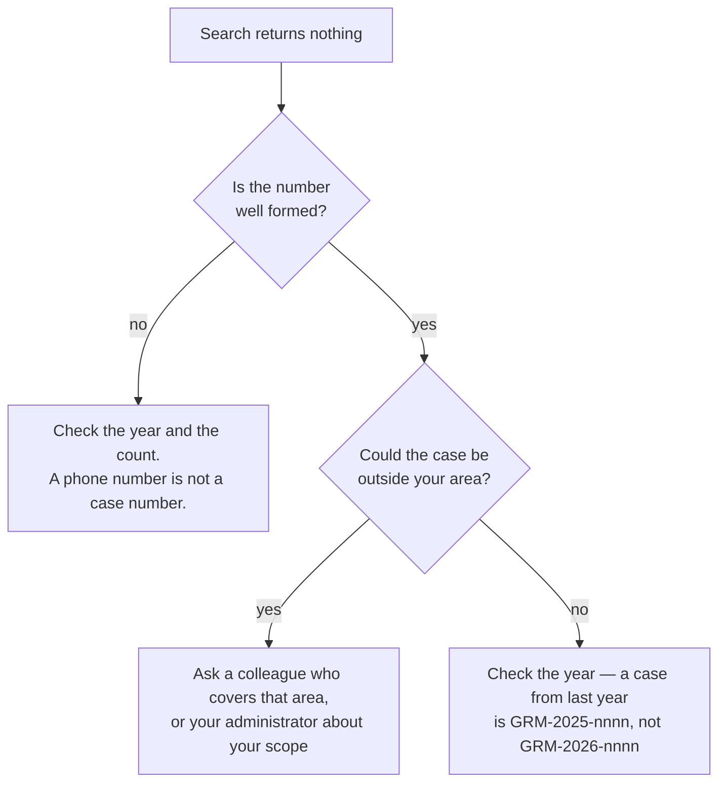

# Finding a case

The most common thing you will be asked: somebody rings, quotes a
number, and wants to know what has happened.

## Case numbers

Every grievance has two identifiers. Use the first with people.

| | Example | For |
|---|---|---|
| **Case number** | `GRM-2026-0001` | people — say it, write it, quote it |
| **Id** | `01M3AT4JSSXFYG02CXC8S6K20X` | the system — links, the audit chain |

The number is the year, then the case's number within that year. It
restarts each January, so `GRM-2027-0001` is the first case of 2027.
Four digits is a minimum, not a limit — the ten-thousandth case of a
year is `GRM-2026-10000`.

## Looking one up

1. Open the workbench at **`/console/grm`**.
2. Type the number into the **Case number** box at the top.
3. Press **Enter**, or click **Find**.

If exactly one case matches, it opens straight away.

### Type it however it reached you

All of these find the same case:

```
GRM-2026-0001     grm-2026-0001     GRM20260001
2026-0001         20260001          GRM 2026 0001
```

It also forgives what people write when copying a number off a slip or
hearing it down a bad line:

| They wrote | It finds |
|---|---|
| `GRM-2O26-OOO1` (letter O for zero) | `GRM-2026-0001` |
| `GRM-2026-OOI1` (and an I for one) | `GRM-2026-0011` |

### Part of a number still helps

If the caller only has half of it, type what they have. A partial match
narrows the queue rather than jumping to one case.

## If nothing comes back



!!! warning "A number you were given is not a key"
    Searching only looks at cases you can already see. If the number
    belongs to a case outside your area, the search returns nothing —
    the same as if it did not exist. That is deliberate, not a bug.

## Clearing the search

Click **Clear** beside the box to return to the full queue. The quick
filters and your selection are unaffected.
