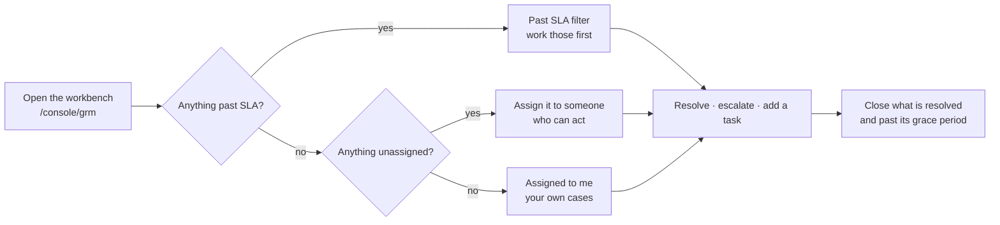

# GRM Officer — running the grievance queue

!!! info "Who this is for"
    The person who **works** grievances: triages what comes in, gives
    each case to somebody who can act on it, keeps it moving before its
    SLA runs out, and closes it with a record of what happened.

    Raising a grievance is covered under
    [Parish Chief / Field officer](../field/grievances.md). This section
    is about what happens next.

A grievance is a **case**. It arrives, it is given to somebody, work is
done on it, and it ends with a written explanation. The system's job is
to make sure none of those steps can be skipped quietly.

## The shape of a day

## What you can do, and where

| Task | Page |
|---|---|
| Find a case somebody has phoned about | [Finding a case](finding-a-case.md) |
| Work through the queue, in the right order | [Working the queue](working-the-queue.md) |
| Give a case to somebody | [Assigning a case](assigning.md) |
| Break a case into pieces of work | [Tasks](tasks.md) |
| Send a case up a tier, or let the SLA do it | [Escalation and SLA](escalation.md) |
| End a case properly | [Resolving and closing](resolving.md) |
| Open a data correction from a grievance | [Linking to an update](linked-updates.md) |

## Three rules worth knowing before you start

**You can only see cases in your area.** The queue, the counts on the
dashboard and the sidebar badge all apply the same rule, so they cannot
disagree with each other. If a colleague can see a case and you cannot,
that is a scope question for your administrator, not a fault.

**You can only assign a case to someone who could actually work it.**
Their role has to carry the case's tier and their area has to cover the
household. The picker only offers people who pass both, so an empty
picker means something real — see [Assigning a case](assigning.md).

**A closed case is finished.** No notes, no tasks, no corrections, and
there is no reopen. If more comes to light, raise a new grievance and
reference the old number in it.

## The buttons you are offered are the ones that will work

The workbench asks the server what each case will currently accept and
only shows those actions. If a button is missing, the case is not in a
state for it — a resolved case has no **Escalate**, an open case has no
**Close**.

The one exception is **Resolve**, which stays visible but greyed out
when tasks are still open, with the count beside it. Hiding it would
remove the only place that tells you why you cannot resolve yet.
