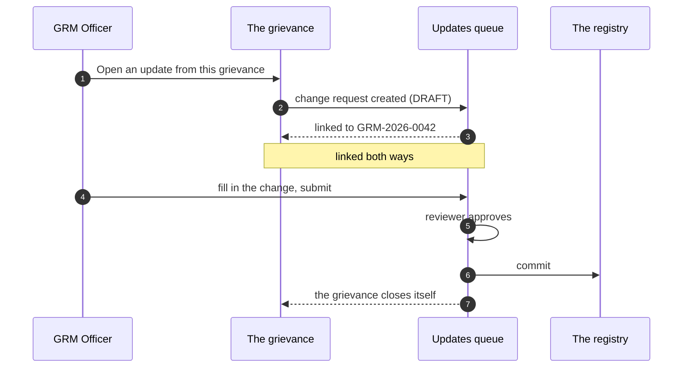

# Linking to an update

Most data-correction grievances end in an actual change to the record.
That change goes through the Updates workflow (UPD), not through GRM —
and the two are linked in both directions so neither is orphaned.

## Opening an update from a case

1. Open a **Data correction** grievance that names a household.
2. In the **DATA UPDATE** block, click **Open an update from this
   grievance**.

That creates a change request in **Draft**, linked both ways.

## Finding the update afterwards

The case panel shows **Open update UPD-2026-0044… in the Updates
Queue**. Click it.

It is a **Draft**, so in the Updates queue it is under the **Drafts**
tab — not Pending. A draft is not yet anybody's review work; it is
waiting for somebody to fill in the change and submit it.

!!! note "This used to go wrong"
    The link used to build a made-up identifier and navigate to an
    unrelated change request, and the queue had no Drafts tab at all —
    so a correction raised from a grievance went to a status no screen
    displayed. Both fixed in September 2026.

## The grievance closes itself

When the linked update **commits**, the grievance closes automatically,
with a narrative saying which change request closed it.

You do not resolve or close it by hand. If you try, you will find it is
already done.

## One update per grievance

Once a case has a linked update, the button to open one **disappears**.
The service refuses a second, so offering the button would only ever
produce an error.

If the first update was wrong, deal with it in the Updates queue —
reject it and raise a corrected one there.

## When the button is not there

| What you see | Why |
|---|---|
| No **DATA UPDATE** block | the case is not a Data correction |
| *"Name the household first"* | the case does not name a household, and an update has to be about a record |
| A link instead of a button | an update already exists — that is the link to it |
| Nothing, on a closed case | closed cases are read-only |
