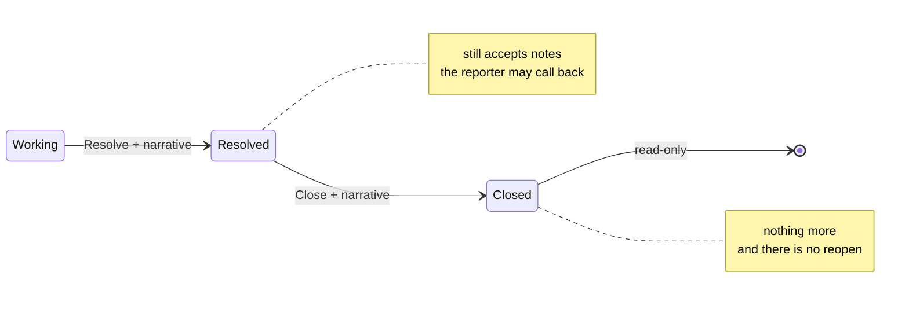

# Resolving and closing

Two steps, not one, and they mean different things.

| | What it says |
|---|---|
| **Resolve** | we have done the thing — here is what we did |
| **Close** | the case is finished and will not change again |

The gap between them is the grace period: the citizen has been told,
and has time to come back if the answer is wrong.

## Resolving

1. Close every open task first — see [Tasks](tasks.md).
2. Open the case and click **Resolve with narrative**.
3. Pick a **reason**.
4. Write the **narrative**.
5. **Resolve**.

### What to write

The narrative is what an auditor reads in two years, and what the next
officer reads if the citizen comes back. Say what was found and what was
done about it.

!!! success "Good"
    *"Household visited 12 May. Surname was recorded as 'Nsubuga' and
    the NIN shows 'Ssubuga'. Corrected via UPD-2026-0044, committed
    14 May. Reporter informed by phone the same day."*

!!! failure "Not good"
    *"Resolved."* — this tells the next person nothing, and it is what
    they will have instead of you.

### If Resolve is greyed out

Tasks are still open. The count is beside the button. Close them.

## Closing

Available once a case is resolved.

1. Open the case and click **Close grievance**.
2. Pick a **reason** and write a **closing narrative**.
3. **Close grievance**.

The closing narrative is the last word on the case. Usually it records
that the grace period passed without the citizen coming back, or that
they confirmed they were satisfied.

## Closing several at once

Tick the rows, click **Close**. Only resolved cases can be closed, so
the button shows how many of your selection qualify and is disabled if
none do. Anything refused is listed afterwards with its case number and
reason.

## A closed case is read-only

Once closed, the case accepts **nothing**:

| | |
|---|---|
| notes | no |
| new tasks | no |
| moving a task | no |
| opening a linked update | no |
| reopening | **there is no reopen** |

The comment box is replaced by a line saying so.

!!! warning "There is no reopen, by design"
    The SAD does not describe re-opening a grievance, so the system
    does not invent one. Turning a closed, audited case back into a
    live one raises questions nobody has answered: does the SLA clock
    restart, does it need approval, is the reporter told?

    **If more comes to light, raise a new grievance** and quote the old
    case number in its narrative. The two are then both in the record,
    in order, which is what an audit needs.

### Why the thread stops too

Notes used to be allowed on a closed case. That is right for a case
still being worked and wrong for a settled one: the closing narrative is
meant to be the last word, and a thread that keeps growing after it
means an auditor cannot tell which parts were the basis of the closure
and which arrived later.

## The automatic close

A grievance with a linked update closes **on its own** when that update
commits. You do not need to close it by hand.

See [Linking to an update](linked-updates.md).
