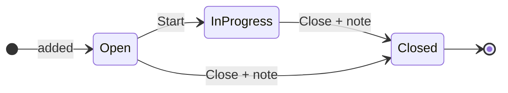
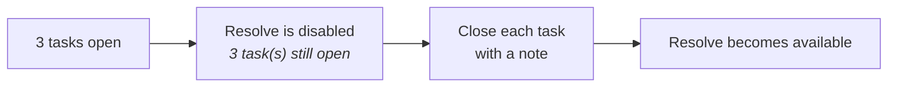

# Tasks

Some cases are one action. Others need a visit, a phone call and a
document, possibly by different people. Tasks are how a case is broken
into pieces of work that can be tracked separately.

!!! info "Who can add one"
    GRM Officers. Field officers work the tasks they are given.

## Adding a task

1. Open the case.
2. In the **Tasks** panel, click **Add task**.
3. Give it a **title** — what needs to happen, in a few words.
4. Add a **description** — what the assignee should do and how they
   should report back.
5. Pick the **assignee**.
6. **Add task**.

The assignee picker applies the same rule as case assignment: a task is
work at the case's tier, so it takes the case's rule. See
[Assigning a case](assigning.md).

## The task lifecycle

| Button | Who sees it | What it does |
|---|---|---|
| **Start** | the assignee, or a GRM Officer | moves it to In progress |
| **Close** | the assignee, or a GRM Officer | asks for a note, then closes it |

Closed is final. There is no reopening a task — add a new one.

## Closing a task asks what you did

You cannot close a task without writing something. The box is required.

Write what was **done**, or why the task is being **dropped**:

!!! success "Good"
    *"Visited on 12 May. Reporter confirmed the surname spelling
    against the LC1 register. Correction raised as UPD-2026-0044."*

!!! failure "Not good"
    *"Done."*

The note becomes a **comment on the grievance**, not a field on the
task. That is deliberate: the case keeps one timeline, rather than a
thread plus a set of closing notes filed on tasks nobody opens.

## Tasks block resolution

**A grievance cannot be resolved while any task is open.**

The **Resolve** button stays on screen, greyed out, with the number of
open tasks beside it. It is left visible on purpose — hiding it would
take away the only place that tells you why you cannot resolve.

So the sequence at the end of a case is always: close the tasks, then
resolve the case, then close the case.

## Tasks and who can see the grievance

Holding an open task on a case lets you see that case, even if it is
outside your usual area. That is how somebody can be given a specific
piece of work without being given a whole district.

It grants access to **that one case**, never to a class of cases.
