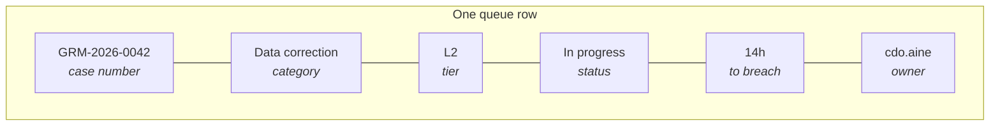
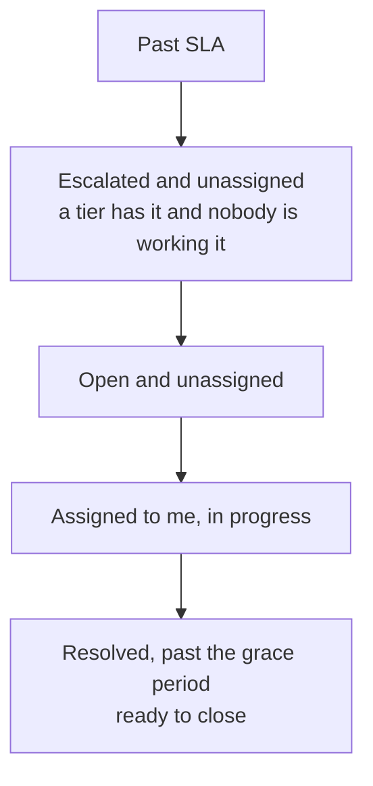

# Working the queue

The workbench is at **`/console/grm`**. It lists every grievance you can
see, newest first, with its case number, category, tier, status, SLA and
owner.

## Quick filters

Four chips across the top. Each shows a count, computed with the same
rule as the list it opens — so the number and the rows always agree.

| Filter | Shows | Use it for |
|---|---|---|
| **Past SLA (any tier)** | breached, not yet resolved or closed | start here every morning |
| **Open L1 — Parish Chief** | at L1, still open | what the parish has not picked up |
| **Escalated** | every escalated case | what is waiting for a receiving tier |
| **Assigned to me** | yours, not closed | your own work |

!!! note "\"Assigned to me\" means you"
    It compares each case's owner against your username. It used to
    match *any* assigned case, which on a busy queue meant nearly all of
    them — and because the count came from the same rule, nothing
    looked wrong. Fixed in September 2026.

Click a chip to filter, click it again or press **Clear** to go back.

## Reading a row

The SLA chip turns red once the window has passed. It counts against
**the current tier's** window, from when that tier received the case —
not from when the case was first opened.

## Opening a case

Click any row. The case panel shows the narrative, the household, the
reporter, the tasks, the notes and the timeline.

On a wide screen the list takes the full width and the case opens as a
drawer over it. Close the drawer with **×** and reopen it with **Open
case** in the toolbar.

## The order to work in

Breached cases first: the SLA is the promise made to the citizen, and it
is the one thing that cannot be recovered once it is gone.

## Acting on several at once

Tick the boxes on the rows you want, then use **Assign**, **Escalate**
or **Close** in the toolbar.

Each button tells you how many of your selection it can actually move.
If it says **7 of 12**, five of the ticked cases are in a state that
will not accept it — the tooltip says which state. If none qualify the
button is disabled, so **Close** is greyed out on a queue of open cases
because close only applies to a resolved one.

The confirmation dialog lists **every case number** it will act on. Check
that list; it is the last point at which a mistake is cheap.

Afterwards a panel below the queue shows what happened, row by row:

| | |
|---|---|
| **done** | went through |
| **refused** | with the reason, and the case number as a link |

Click any refused number to open that case and deal with it. Press
**Dismiss** to clear the panel.

!!! tip "Every ticked case is attempted"
    The buttons predict what will work, but the server decides. A case
    is never silently skipped — if it refuses, it is in that list with
    the reason.
