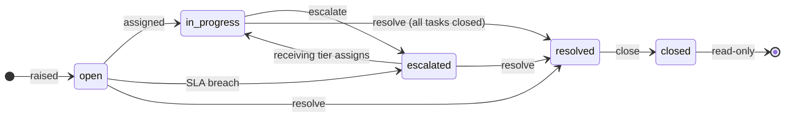
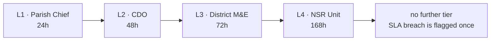
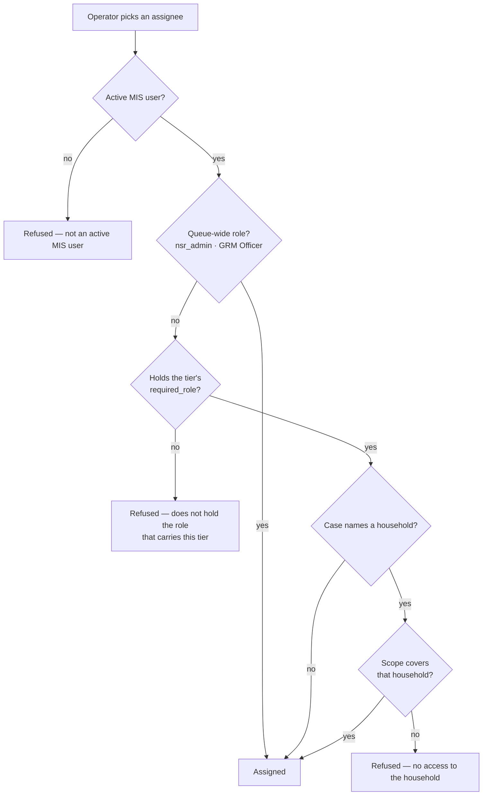
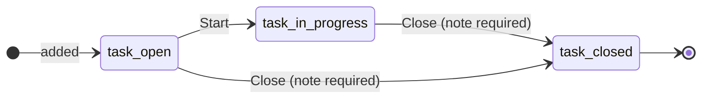
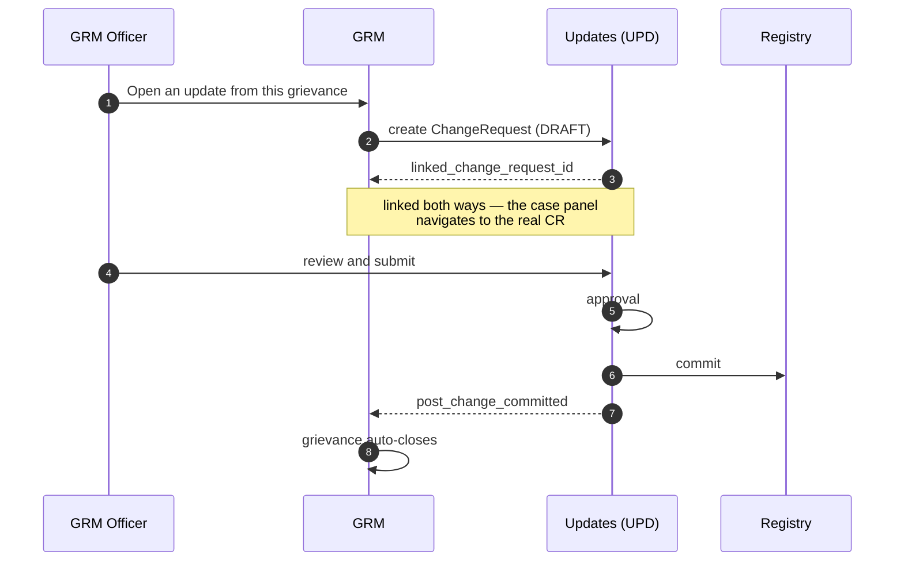
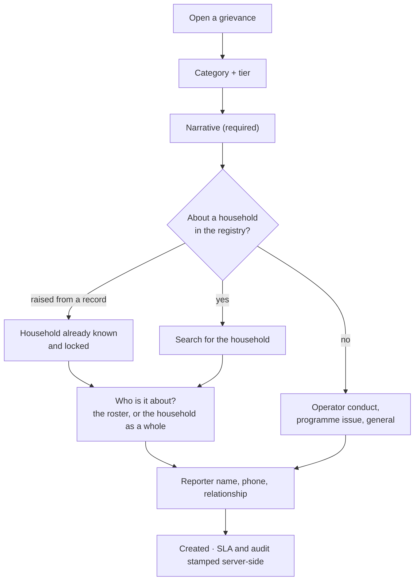

# GRM — Grievance

!!! info "Status"
    **Built and in use.** Four-tier case handling with tasks and a
    running note thread, role- and scope-checked assignment, SLA
    escalation, the GRM↔UPD bridge, and a case history read from the
    audit chain. Revised 25 September 2026 after a week of QA fixes.

GRM is the citizen-facing complaints and corrections channel. A
grievance is a case: it is opened, assigned to somebody who can work
it, escalated if its tier runs out of time, resolved with a narrative,
and closed. From then on it is read-only.

---

## The case number

Every grievance carries two identifiers, and they are for different
readers.

| | Example | For |
|---|---|---|
| **Reference** | `GRM-2026-0001` | people — say it, write it, quote it |
| **Id** | `01M3AT4JSSXFYG02CXC8S6K20X` | the system — URLs, the audit chain, links from other modules |

Three other modules number their records the same way, so a number
tells you which queue it belongs to before you have typed it anywhere:

| Prefix | Record | Module |
|---|---|---|
| `GRM-` | grievance | this one |
| `UPD-` | change request | [Updates](upd.md) |
| `DRS-` | data request | [Data requests](api-drs.md) |
| `REF-` | referral | [Referrals](ref.md) |

The reference is what you give a citizen: the year, and the case's
number within that year. The count restarts each January, so the first
grievance of 2027 is `GRM-2027-0001`.

Four digits is a minimum, not a limit — the ten-thousandth case of a
year is `GRM-2026-10000`.

**Type it however it reaches you.** The search box on the workbench
accepts all of these and finds the same case:

```
GRM-2026-0001      grm-2026-0001      GRM20260001
2026-0001          20260001           GRM 2026 0001
```

It also forgives what people write copying a number off a slip: a
letter **O for zero**, or **I or l for one**.

!!! note "A number you were told is not a way past your scope"
    Searching filters the cases you can already see. If the reference
    belongs to a case outside your area, the search returns nothing —
    the same as if it did not exist.

!!! warning "The reference never changes"
    It is assigned once when the case is opened. Escalation, resolution
    and closure do not touch it, because a number quoted to a citizen
    has to keep meaning that case.

!!! warning "A case number can be guessed — that is why scope matters"
    The number after yours is somebody's case. Guessing it opens
    nothing: the search and the case route both apply your scope, so a
    reference you were not given behaves exactly like one that does not
    exist. What a sequence does disclose is **how many** grievances the
    registry has taken. [ADR-0038](../appendices/adrs.md) records that
    trade and why it was accepted.

---

## The case lifecycle



**There is no reopen.** The SAD does not describe one, so the system
does not invent one. A closed case cannot change again by any route —
see [A closed case is read-only](#a-closed-case-is-read-only).

| Status | Meaning | Accepts |
|---|---|---|
| `open` | Raised, nobody working it | assign, escalate, resolve, task, note |
| `in_progress` | Somebody owns it | assign, escalate, resolve, task, note |
| `escalated` | Sent up a tier, awaiting pickup | assign, escalate, resolve, task, note |
| `resolved` | Settled, in the grace period | close, note |
| `closed` | Final | nothing |

The console never decides this for itself. Every grievance the API
returns carries an `allowed_actions` list, and the workbench renders
buttons from it — so a button the server would refuse is not offered.

---

## The escalation ladder

Four tiers, each with the role that carries it and the window it gets.



!!! warning "These numbers are configuration, not code"
    The tier, its role and its SLA live in the `GrmTierRule` table
    (one active row per tier), seeded from SAD §5.1 and §4.4. Operations
    can retune a window without a deploy. There is **no code fallback** —
    a tier with no active rule refuses rather than guessing, which is why
    a half-configured ladder fails loudly.

    See [ADR-0035](../appendices/adrs.md).

**Escalation clears the assignee and restarts the clock.** The
receiving tier gets its full window from the moment it receives the
case, not from when the case was first opened. Before this was fixed,
escalating a case that had already blown its L1 deadline handed L2 a
deadline in the past — on production, cases sat 2,900 hours "overdue"
at a tier they had only just reached.

### Automatic escalation

`escalate_breached_grievances` runs on a schedule, moves each breached
case up exactly one tier per run, and records `system` as the actor
with reason `SLA breached`. A case already at L4 is flagged once rather
than escalated in a loop.

---

## Who can be given a case



Two conditions, one exemption:

- **Role** — the tier's `required_role` from the ladder above.
- **Scope** — the assignee's `OperatorScope` must reach the household,
  checked with the same helper the household detail views use.
- **Exempt from the role condition:** `nsr_admin` and `GRM Officer`
  already see and act on every case. A rule that let them read a case
  but not be given it would be a second visibility rule beside the
  first.

A grievance about no household has no geography, so geography does not
decide it.

!!! note "The picker and the guard are the same rule"
    `GET /grm/grievances/{id}/assignable/` returns the candidates, and
    `/assign/` applies the identical check. The list can never contain
    a name the assignment would refuse. Naming yourself is not an
    exemption — "Assign to me" goes through the same rule.

!!! tip "If the picker looks empty"
    It means nobody holds that tier's role with access to that
    household. That is a **directory** problem, not a system fault:
    somebody needs the role granted, or the case needs escalating to a
    tier that has holders. Check the role catalogue in Admin.

---

## Tasks

A GRM Officer can break a case into tasks. Each task is assigned under
the same role-and-scope rule as the case itself, because a task is work
at the case's tier.



**A grievance cannot be resolved while any task is open.** The Resolve
button stays visible and disabled, with the count of what is holding it
up — hiding it would remove the only place that says why.

**Closing a task requires a note** saying what was done, or why it is
being dropped. The note is stored as a comment on the *grievance*, not
as a column on the task, so the case keeps one timeline instead of a
thread plus a set of closing notes nobody opens.

---

## Notes

A running thread, available from the moment the case is opened —
not only at resolution. Use it for a visit made, a call taken, a
document still missing.

Notes are **not** transitions: writing on an open case leaves it open.

A closed case accepts none. A resolved case still does, because the
grace period before closure is exactly when a reporter calls back.

---

## The GRM → UPD bridge

SAD §4.4: *a grievance that resolves to a data correction opens a
linked UPD; the UPD's commit closes the GRM case.*



Points that used to catch people out:

- The update is created as a **DRAFT**, so it appears under the
  **Drafts** tab of the Updates queue. Before that tab existed the
  draft went to a status no screen looked at.
- The case panel links to the **real** `linked_change_request_id`. It
  previously synthesised an id and navigated to an unrelated change
  request.
- Once a case has a linked update, the offer to open one disappears.
  The service refuses a second, so offering the button was offering an
  error.

---

## Who sees which grievances

One rule, in `apps/grievance/visibility.py`, used by the workbench
list, the home dashboard tile, the sidebar badge and the "in scope"
label — so those numbers cannot disagree.

| You are | You see |
|---|---|
| Superuser, `nsr_admin`, or `GRM Officer` | every grievance |
| National `OperatorScope` | every grievance |
| District / parish / village scope | grievances in those units |
| No active scope | only what you own |
| Anonymous | nothing |

**Ownership always grants access** to a specific case: the grievance is
assigned to you, or you hold an open task on it. That covers work
somebody deliberately gave you, including rows created before
assignment was scope-checked.

!!! warning "Two rules is the classic failure here"
    This module previously had two. The workbench asked whether you
    were a superuser or in a group literally named "GRM Officer"; the
    dashboard counted through the registry's ABAC scope. An `nsr_admin`
    with a national scope matched the second and not the first, so the
    dashboard read "5 open" beside an empty workbench.

---

## The case history

The timeline in the case panel and the Audit chain drawer both read the
**audit chain** — the real events, in the order they happened, with the
actor and timestamp each one carries.

`GET /grm/grievances/{id}/audit/` assembles the case's chain
server-side: the opening, assignments, escalations, resolution,
closure, every task transition, every note, and the linked update. It
has to be done server-side because task and comment events are keyed by
the task's or comment's own id — the grievance id is inside
`field_changes` — so a client filtering the audit list by grievance id
gets the case-level rows and nothing else.

The endpoint sits behind the same visibility rule as every other detail
route: a user who cannot see the case cannot read its history.

!!! note "The timeline shows what happened, not what probably happened"
    It used to be reconstructed from the case's current state — a
    reporter phone became "Via parish channel", any escalation became
    "System GRM · SLA breach auto-escalator", and rows carried a dash
    where a timestamp belongs. None of it had occurred.

---

## A closed case is read-only

Closing a case ends it. Beyond the transitions, the case accepts no
notes, no new tasks, no task movements, and no linked update.

The closing narrative is the last word on what happened. A thread that
kept growing after it would mean an auditor could not tell which parts
were the basis of the closure and which arrived afterwards.

**If there is more to record, raise a new grievance.**

The audit chain is the one exception, by design: it is append-only and
records access and operations rather than the case's content, so
writing an event about a closed grievance does not change the
grievance.

See [ADR-0036](../appendices/adrs.md).

---

## Raising a grievance

One dialog, wherever it is opened from — the GRM workbench, a
household record, or a member record.



- The household question is **asked outright** and cannot be skipped.
  It decides whether the case can ever become a data correction. It is
  not asked when the dialog is opened from a record, because the answer
  is already yes.
- **A member can be named.** A complaint about one person in a
  household of nine used to be filed against the household, leaving the
  handler to read the narrative to find out who.
- Categories and tiers come from one shared vocabulary. The household
  screen previously had its own copy under different labels, so the
  same grievance read differently depending on where it was raised.

---

## Working the queue

### Quick filters

| Filter | Shows |
|---|---|
| Past SLA (any tier) | breached and not yet resolved or closed |
| Open L1 — Parish Chief | at L1, still open |
| Escalated | every escalated case |
| Assigned to me | `assigned_to` is **you**, and not closed |

The count on each chip is computed with the same predicate as the list
behind it, so the number and the rows cannot disagree.

!!! note
    "Assigned to me" used to test *assigned to anyone*. On a queue where
    most cases have an owner it matched nearly all of them — and because
    the count came from the same predicate, nothing looked inconsistent.

### Bulk actions

Tick rows, then Assign, Escalate or Close.

- A bulk button **counts how many of the selected cases the server
  would accept**, disables at zero with the reason, and shows "7 of 12"
  when only some qualify. Close applies to a resolved case, so on a
  queue of open ones it is disabled.
- Every ticked row is still **attempted**: the prediction shapes the
  buttons, the server decides.
- The confirmation dialog lists **every id** it will act on.
- Afterwards, the panel below the queue lists each row that refused,
  with the reason, each id a link to that case.

---

## Where it lives

| Path | What |
|---|---|
| `apps/grievance/` | Django app |
| `apps/grievance/visibility.py` | who sees what; `allowed_actions` |
| `apps/grievance/assignees.py` | who may be given a case |
| `apps/grievance/services.py` | the transitions and their guards |
| `/api/v1/grm/` | DRF surface |
| `design/v0.1/screens/screens-grm.jsx` | GRM workbench |
| `design/v0.1/components/open-grievance.jsx` | the shared raise dialog |

## Endpoints

| Endpoint | Verb | Purpose |
|---|---|---|
| `/api/v1/grm/grievances/` | GET, POST | List (`?q=` case number, `?active=true`, `?status=`, `?tier=`), create |
| `/api/v1/grm/grievances/{id}/` | GET | Read, with `allowed_actions` |
| `/api/v1/grm/grievances/{id}/assign/` | POST | Assign — role and scope checked |
| `/api/v1/grm/grievances/{id}/assignable/` | GET | Who may carry it (`?q=`, `?for_tier=`) |
| `/api/v1/grm/grievances/{id}/escalate/` | POST | Up one tier |
| `/api/v1/grm/grievances/{id}/resolve/` | POST | Resolve with a narrative |
| `/api/v1/grm/grievances/{id}/close/` | POST | Close |
| `/api/v1/grm/grievances/{id}/comments/` | GET, POST | The note thread |
| `/api/v1/grm/grievances/{id}/audit/` | GET | The case's audit chain |
| `/api/v1/grm/grievances/{id}/open-change-request/` | POST | Bridge to UPD |
| `/api/v1/grm/grievances/reasons/` | GET | The reason catalogue |
| `/api/v1/grm/grievances/overdue/` | GET | Past SLA, role-scoped |
| `/api/v1/grm/grievances/me/` | GET | Am I a GRM Officer? |
| `/api/v1/grm/tasks/` | GET, POST | Tasks |
| `/api/v1/grm/tasks/{id}/transition/` | POST | Move a task (note required to close) |

!!! warning "`?for_tier=`, not `?tier=`"
    On `/assignable/`, ask about a different tier with `for_tier`. The
    viewset already reads `tier` to mean "cases at this tier", and on a
    detail route that filters away the case being asked about — a 404
    that looks like a permission problem.

## Key entities

| Entity | What |
|---|---|
| `Grievance` | the case — `id` is the ULID key, `reference` the number people use |
| `GrievanceTask` | a piece of work on it |
| `GrievanceComment` | one note in the thread |
| `GrmTierRule` | the ladder: tier → role, SLA hours |

## ADRs

- **ADR-0035** — the tier ladder is configuration, and it decides who may hold a case
- **ADR-0036** — a closed grievance is read-only
- **ADR-0037** — a grievance carries a case number people can use (superseded)
- **ADR-0038** — case numbers run in sequence, and what that costs
- ADR-0026 — ABAC multi-level scope (the scope half of assignment)
- ADR-0028 — role catalogue (where `required_role` comes from)
- ADR-0029 — the audit chain is append-only
- ADR-0014, ADR-0015 — programme and referral context

## Stories

US-032, US-033, US-034, US-035, US-036, US-094, US-095, US-S21, US-S22.
